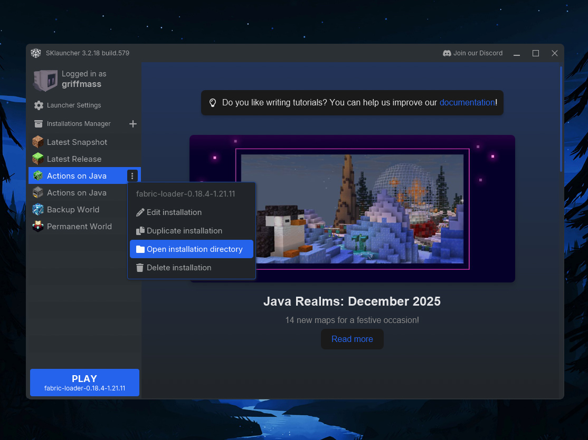

# ❓ Frequently Asked Questions

Here you will find answers to common questions about installing and configuring this modpack.

---

### 1. Is this only for Java Edition, or does it work on Bedrock?

<strong>Show Answer</strong>

 
Yes, this is exclusively for <strong>Minecraft: Java Edition</strong>. These mods will <strong>not</strong> work on Bedrock Edition (Mobile, Console, Windows 10/11).

---

### 2. Which Mod Loader is required? Forge or Fabric?

<strong>Show Answer</strong>

 
This pack uses the <strong>Fabric</strong> mod loader.

---

### 3. What Minecraft version is this for? Will it work if my version is different?

<strong>Show Answer</strong>

 
This pack is built for <strong>Minecraft Java 1.21.11</strong>.
  
While some Resource Packs may work on older versions (like 1.21.10), the <strong>Mods will NOT work</strong> if your game version does not match exactly. Please ensure you are running version 1.21.11.

---

### 4. Can I use these mods with Forge or NeoForge?

<strong>Show Answer</strong>

 
No. These mods are strictly designed for the <strong>Fabric</strong> loader. They will not load or function on Forge.

---

### 5. How do I install the mods?

<strong>Show Answer</strong>

 

**Part 1: Locate your Game Folder**
*Choose your launcher below to see how to open the installation directory.*

**For TLauncher:**

**For Sklauncher:**

---

**Part 2: Installation Steps (Universal)**
*Once your folder is open, follow these steps:*

**Step 1:**

**Step 2:**

---

### 6. How do I install the Resource Packs?

<strong>Show Answer</strong>

 

**Part 1: Locate your Game Folder**
*Choose your launcher below to see how to open the installation directory.*

**For TLauncher:**

**For Sklauncher:**

---

**Part 2: Installation Steps (Universal)**
*Once your folder is open, follow these steps:*

**Step 1:**

**Step 2:**

---

### 7. Is there a specific "Load Order" for the Resource Packs?

<strong>Show Answer</strong>

 
<strong>Yes.</strong> The order in which you list the resource packs is very important. Please follow the exact sequence shown in this screenshot:
  

---

### 8. The Resource Pack says "Incompatible" (Red Text). Will it still work?

<strong>Show Answer</strong>

 
<strong>Yes.</strong> You can safely ignore that warning. All resource packs listed in this repository have been tested and verified to work. Simply confirm "Yes" when Minecraft asks if you want to load them anyway.

---

### 9. My hand looks broken or weird in First-Person view when using "Hold My Items". How do I fix this?

<strong>Show Answer</strong>

 
This is a conflict with the animation settings. Follow these 7 steps to fix it:

**Step 1:** Open the Mod Menu.
 

**Step 2:** Search for "EMF" (or ETF).
 

**Step 3:** Click the Config/Settings button.
 

**Step 4:** Select "Models".
 

**Step 5:** Select "Player Settings".
 

**Step 6:** Turn ON "Prevent first-person hand animations".
 

**Step 7:** Click Done/Save.
 

---

### 10. Can I adjust the distance (Z FOV) of the hand in "Hold My Items"?

<strong>Show Answer</strong>

 
Yes. You can adjust this directly in the resource pack settings:

**Step 1:** Go to your **Resource Packs** menu.
 

**Step 2:** Find `pack_test` and click the **Settings** (Gear/Wrench icon).
 

**Step 3:** Adjust the **Z Offset** slider to your preference.
 

**Step 4:** Click Done.
 

