# 🌿 Actions & Fresh Parity (Fabric 1.21.11)

This repository contains a curated tracking list of Mods and Resource Packs designed to replicate the popular **"Actions & Stuff"** Bedrock aesthetic on **Minecraft Java Edition 1.21.11**.

---

# ❓ Frequently Asked Questions

Here you will find answers to common questions about installing and configuring this modpack.

---

### 1. Is this only for Java Edition, or does it work on Bedrock?

<strong>Show Answer</strong>

 
Yes, this is exclusively for <strong>Minecraft: Java Edition</strong>. These mods will <strong>not</strong> work on Bedrock Edition (Mobile, Console, Windows 10/11).

---

### 2. Which Mod Loader is required? Forge or Fabric?

<strong>Show Answer</strong>

 
This pack uses the <strong>Fabric</strong> mod loader.

---

### 3. What Minecraft version is this for? Will it work if my version is different?

<strong>Show Answer</strong>

 
This pack is built for <strong>Minecraft Java 1.21.11</strong>.
  
While some Resource Packs may work on older versions (like 1.21.10), the <strong>Mods will NOT work</strong> if your game version does not match exactly. Please ensure you are running version 1.21.11.

---

### 4. Can I use these mods with Forge or NeoForge?

<strong>Show Answer</strong>

 
No. These mods are strictly designed for the <strong>Fabric</strong> loader. They will not load or function on Forge.

---

### 5. How do I install the mods?

<strong>Show Answer</strong>

 

First, download the mods from the link below:
 

  

**Step 1:** Locate the folder `mods` then open it.
 
*(If you are using TLauncher or Sklauncher, use the folder button shown below)*
 
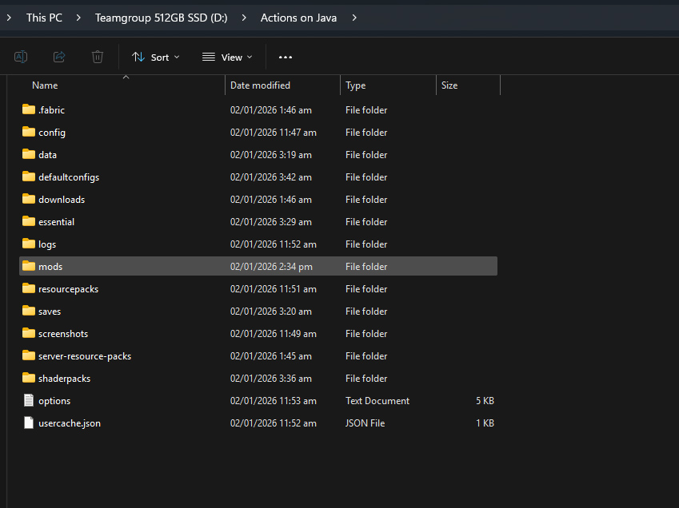

**Step 2:** Paste here all the mods you downloaded from the Google Drive.
 
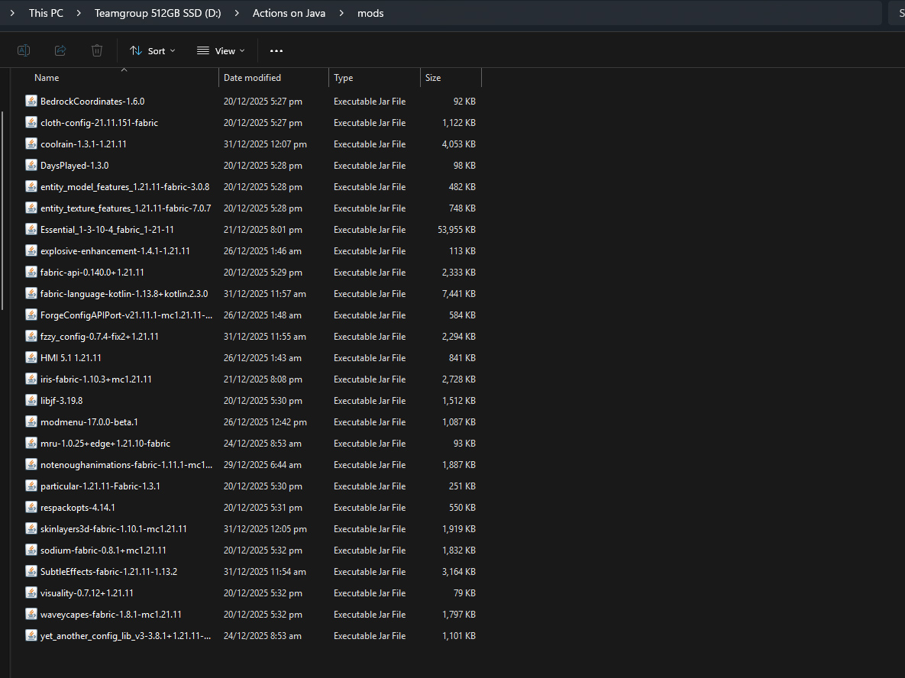

---

### 6. How do I install the Resource Packs?

<strong>Show Answer</strong>

 

First, download the resource packs from the link below:
 

  

**Step 1:** Locate the folder `resourcepacks` then open it.
 
*(If you are using TLauncher or Sklauncher, use the folder button shown below)*
 
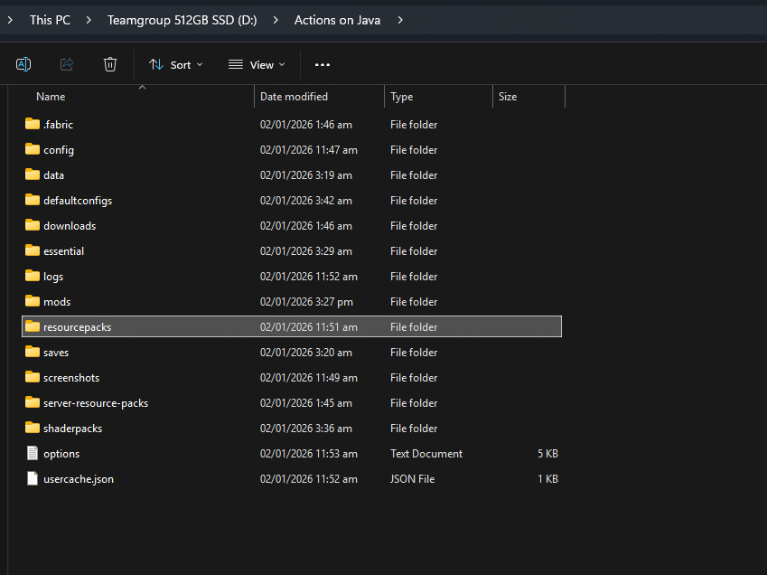

**Step 2:** Paste here all the resource packs you downloaded from the Google Drive.
 
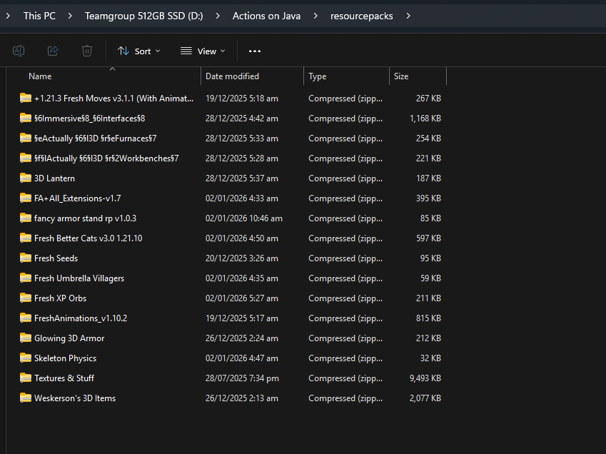

---

### 7. Is there a specific "Load Order" for the Resource Packs?

<strong>Show Answer</strong>

 
<strong>Yes.</strong> The order in which you list the resource packs is very important. Please follow the exact sequence shown in this screenshot:
  
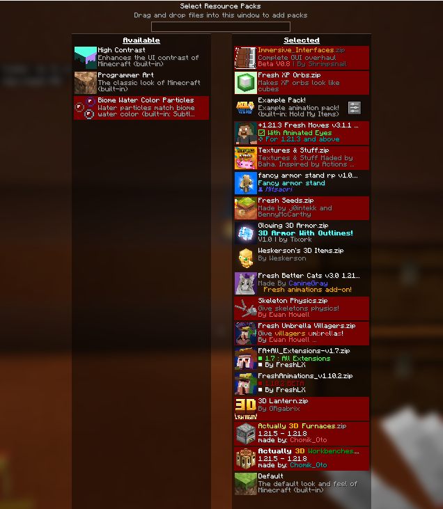

---

### 8. The Resource Pack says "Incompatible" (Red Text). Will it still work?

<strong>Show Answer</strong>

 
<strong>Yes.</strong> You can safely ignore that warning. All resource packs listed in this repository have been tested and verified to work. Simply confirm "Yes" when Minecraft asks if you want to load them anyway.

---

### 9. My hand looks broken or weird in First-Person view when using "Hold My Items". How do I fix this?

<strong>Show Answer</strong>

 

**The Issue:**
You might see a glitch where the items are not properly held by your hands, like this:
 
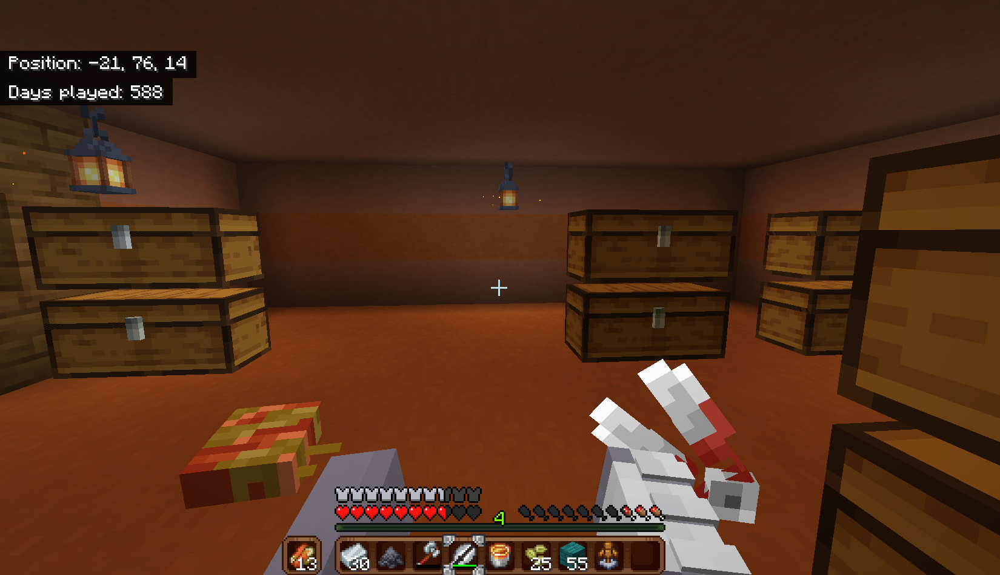

**Step 1:** Press any key to pause the game, then click on the **Mods** button.
 
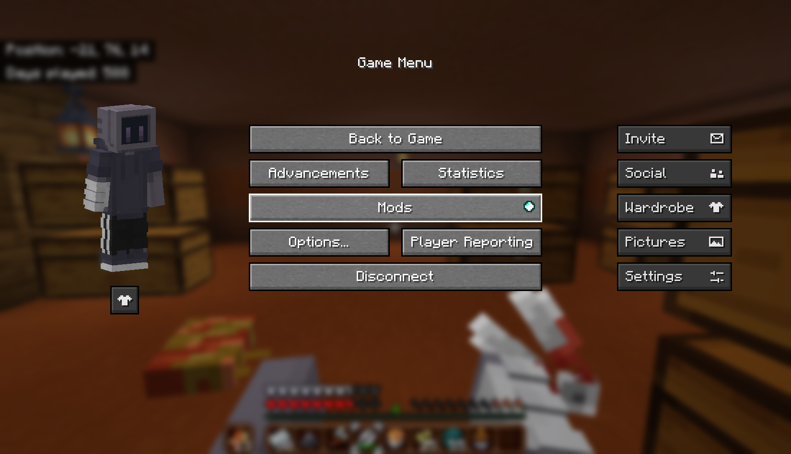

**Step 2:** Locate **EMF** (or ETF), hover your cursor on it, and then click the **Settings icon**.
 
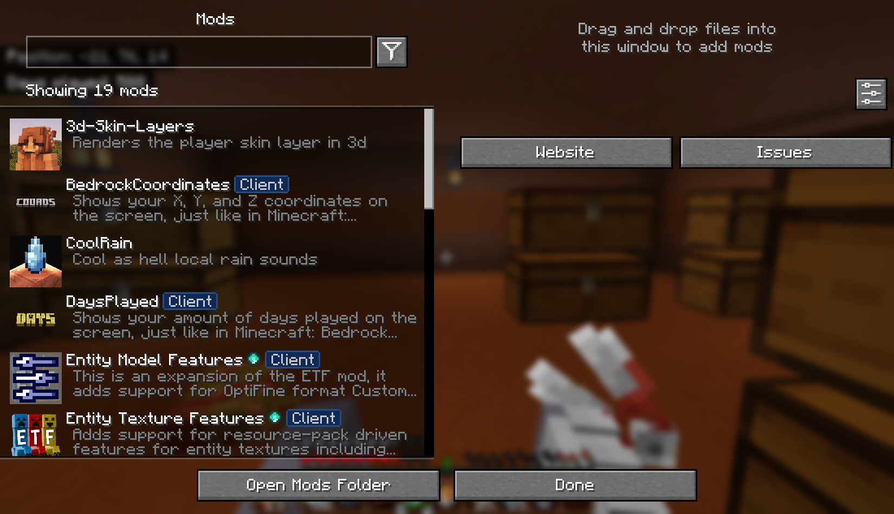

**Step 3:** Click on **Models**.
 
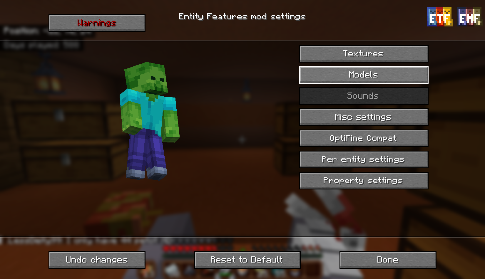

**Step 4:** Click on **Player settings**.
 

**Step 5:** Turn ON **"Prevent first person hand animations"**.
 
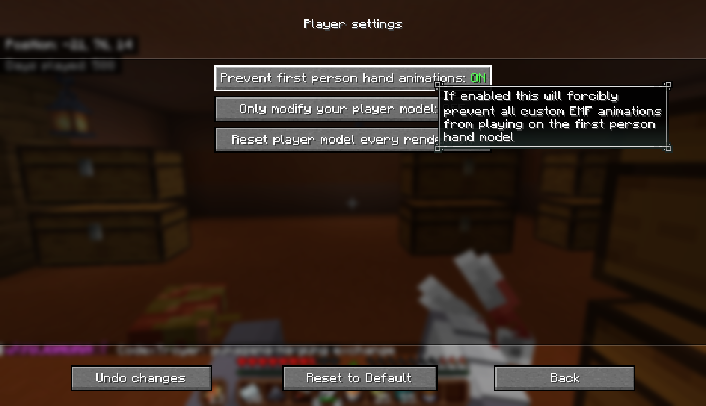

**The Result:**
The problem is fixed and your hand should look normal again.
 
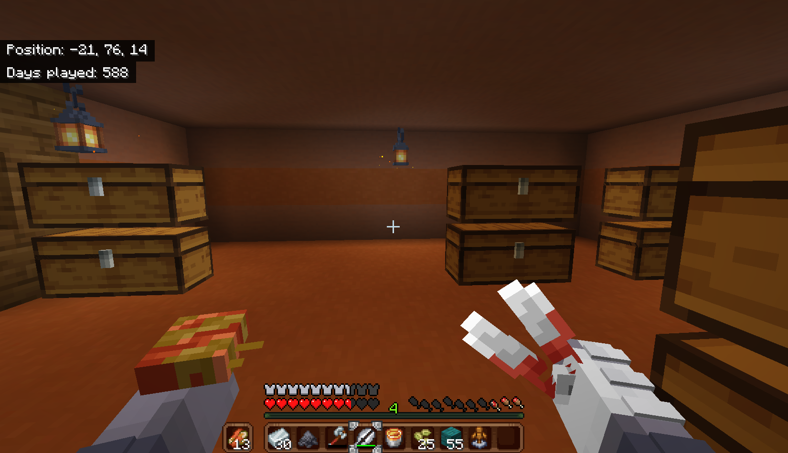

---

### 10. Can I adjust the distance (Z FOV) of the hand in "Hold My Items"?

<strong>Show Answer</strong>

 

**Step 1:** Press any key to pause the game, then click on the **Options** button.
 
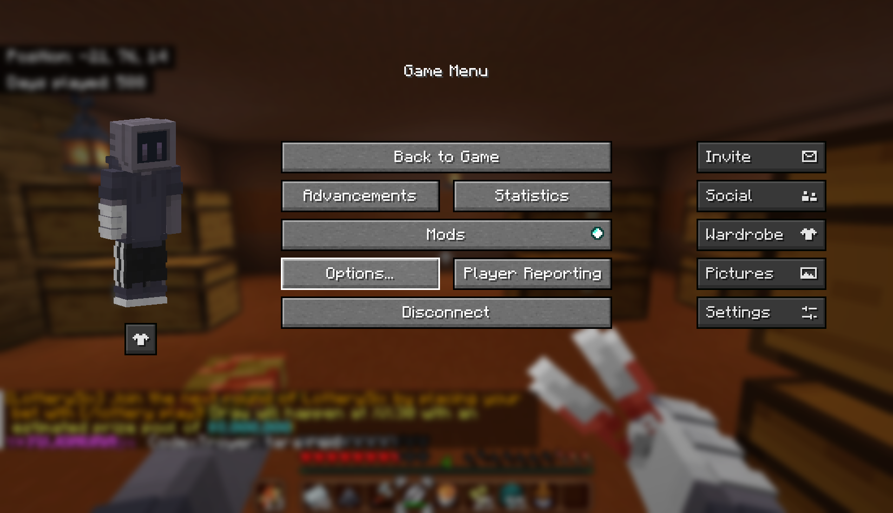

**Step 2:** Click on **Resource Packs...**
 
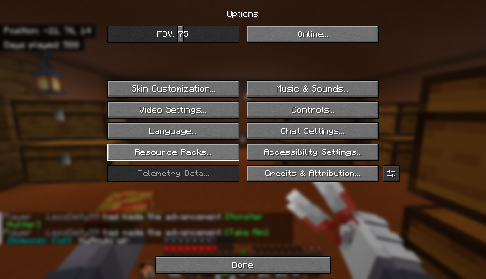

**Step 3:** Find the **Example Pack!** and click the **Settings** (Gear/Wrench icon).
 
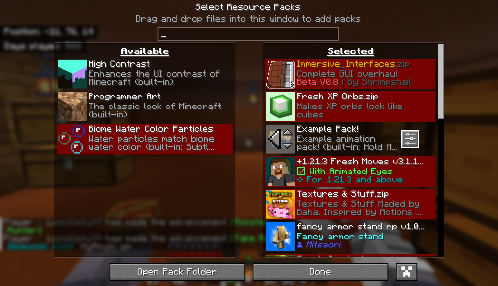

**Step 4:** Adjust the **Z Offset** slider to your preference.
 
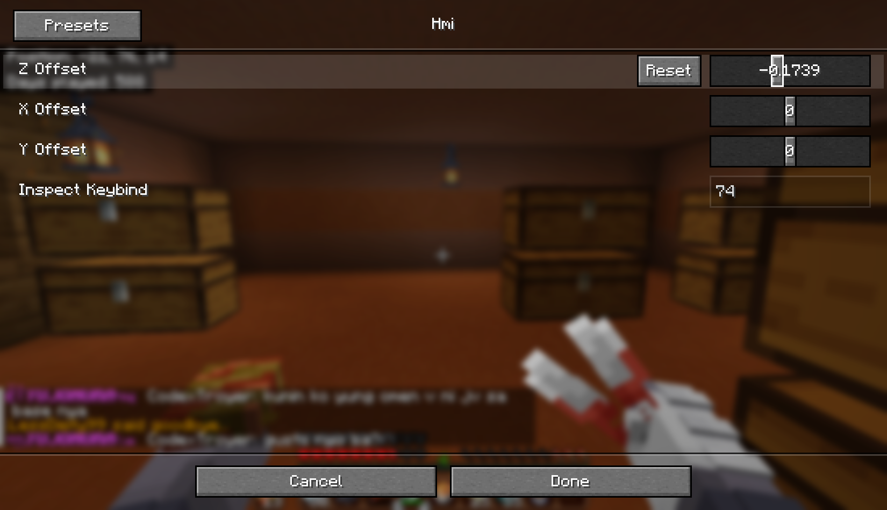

